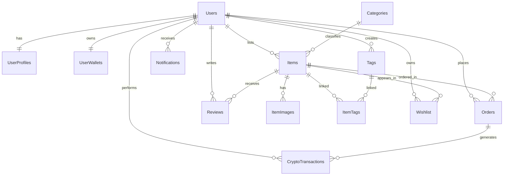
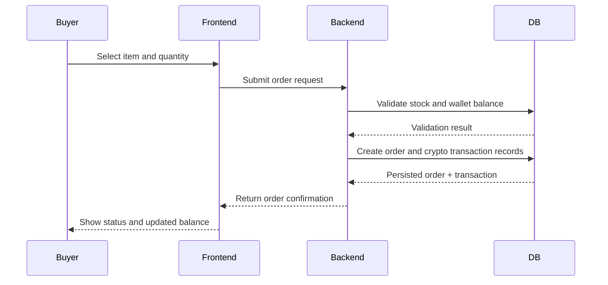

# Team 32 Crypto Marketplace

This document is the living specification for Team 32's CS506 project.

## Team Name

Rug Pullers

## Project Abstract

Team 32 is building a crypto-enabled online marketplace where users can create accounts, list items, browse products, place orders, and track wallet activity. All monetary transactions will be done in RugPull coin.

## Customer

People who uses Facebook marketplace or Ebay, but rather spend crypto for purchases.

## Specification

### Core Functional Scope

1. User accounts and profiles
2. Item listing and inventory management
3. Category and tag based discovery
4. Orders with status tracking
5. Wallet balances and crypto transaction history
6. Wishlist support
7. Item reviews and ratings
8. User notifications

### Data Model

The full schema is maintained in `SCHEMA.md`.

### Typical Purchase Flow

## Technology Stack

Current project artifacts confirm:

- Relational database design is defined in `SCHEMA.md`
- Java coding standards are defined in `STYLE.md`

Planned implementation stack (to be finalized by team):

- Frontend: Web client
- Backend: Java service layer
- Database: SQL relational database

## Standards and Conventions

- Coding style: `STYLE.md`
- Roles and sprint ownership: `ROLES.md`
- Walking skeleton plan: `SKELETON.md`

## Repository Structure

- `README.md`: Project specification overview (this file)
- `SCHEMA.md`: Marketplace database schema and cardinality
- `ROLES.md`: Scrum Master and Product Owner assignments by sprint
- `STYLE.md`: Project coding conventions
- `SKELETON.md`: Walking skeleton notes
- `RESEARCH/`: Research reports and references

## Status

This repository currently contains foundational project documentation. Implementation repositories/modules should be linked here once created.
