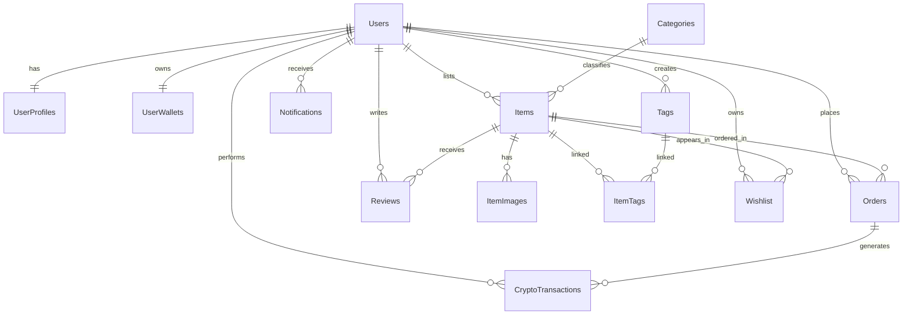
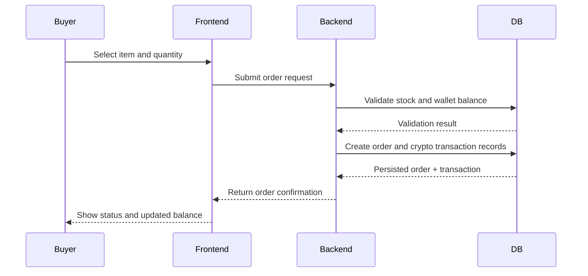

# Team 32 Crypto Marketplace


This document is the living specification for Team 32's CS506 project.

## Team Name

Rug Pullers

## Project Abstract

Team 32 is building a crypto-enabled online marketplace where users can create accounts, list items, browse products, place orders, and track wallet activity. All monetary transactions will be done in RugPull coin.

## Customer

People who uses Facebook marketplace or Ebay but rather use crypto to purchase.

## Specification

### Core Functional Scope

1. User accounts and profiles
2. Item listing and inventory management
3. Category and tag based discovery
4. Orders with status tracking
5. Wallet balances and crypto transaction history
6. Wishlist support
7. Item reviews and ratings
8. User notifications

### Data Model

The full schema is maintained in `SCHEMA.md`.



### Typical Purchase Flow



## Technology Stack

- Frontend: React 19 + Vite 7
- Backend: Java 21 + Spring Boot 4.0
- Database: MySQL
- Infrastructure: Docker + Docker Compose

## Standards and Conventions

- Coding style: `STYLE.md`
- Roles and sprint ownership: `ROLES.md`
- Walking skeleton plan: `SKELETON.md`

## Repository Structure

- `README.md`: Project specification overview (this file)
- `SCHEMA.md`: Marketplace database schema and cardinality
- `ROLES.md`: Scrum Master and Product Owner assignments by sprint
- `STYLE.md`: Project coding conventions
- `SKELETON.md`: Walking skeleton notes
- `docker-compose.yml`: Compose file for setting up and running frontend, backend, & db containers
- `docker-compose_guide.md`: Instructions for setting up docker environment
- `RESEARCH/`: Research reports and references
- `frontend/`: React/Vite frontend server
- `backend/`: Java Spring backend app
- `database/`: MYSQL database schema & setup
- `rpc_currency/`: Custom $RPC cryptocurrency wallet implementation (Java)

## Getting Started

1. Copy the environment template and fill in your values:
   ```bash
   cp .env.example .env
   ```
2. Start all services (frontend, backend, database):
   ```bash
   docker compose up --build
   ```
3. Open `http://localhost:3000` in your browser.

See `docker-compose_guide.md` for more detail.

## What's Implemented

- **User authentication** — signup, login, and logout with BCrypt-hashed passwords (`/api/auth/signup`, `/api/auth/login`, `/api/auth/logout`)
- **User profiles** — display name and bio, created automatically on registration
- **React frontend** — landing page with sign-in and create-account modals wired to the backend
- **Dockerized environment** — all three services (frontend, backend, database) run via Docker Compose
