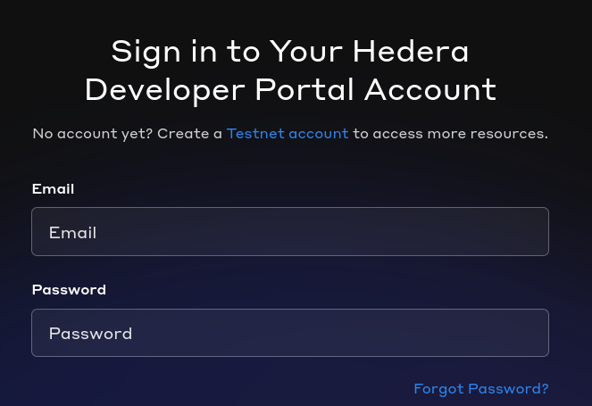
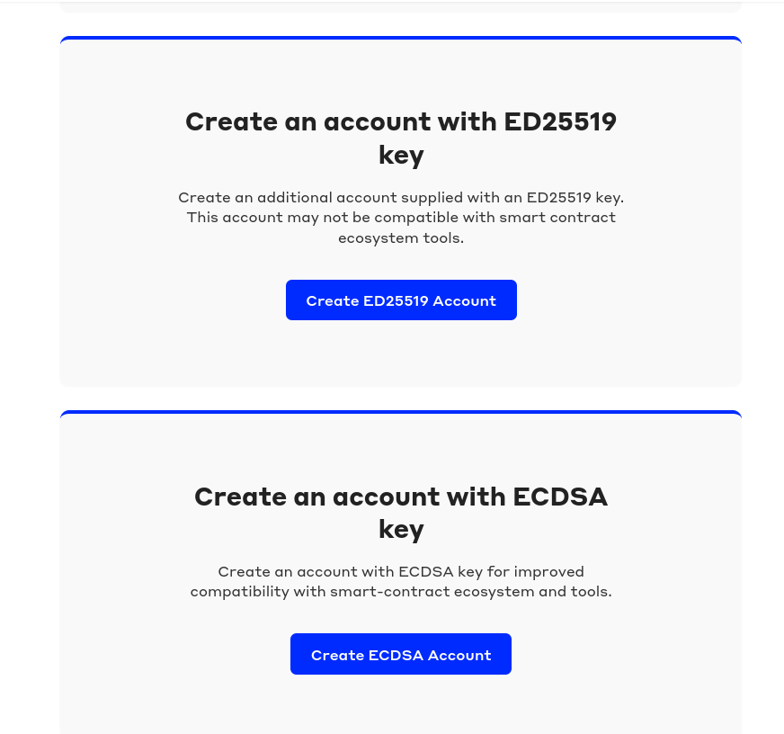
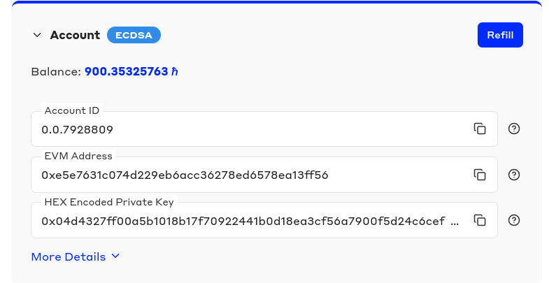

# Hedera Setup

## Index

- [Hedera Setup](#hedera-setup)
  - [Index](#index)
  - [Setting up hedera account](#setting-up-hedera-account)
  - [Setting up the RPC Token](#setting-up-the-rpc-token)
    - [The easy way](#the-easy-way)
    - [Running the jar](#running-the-jar)
      - [Possible issue resolution](#possible-issue-resolution)
      - [On success](#on-success)

## Setting up hedera account

Setting up hedera is the first step to get the project running locally. First go to the [hedera website](https://portal.hedera.com/login).
You should see below:

Once you've created your hedera account and are signed in the portal you should see a screen with a button like this:

Click the "Create ECDSA Account" button. After doing this you will see a new account on your listed accounts page that looks like this: 

From this image we need to values the **AccountId** and **HEX Encoded Private Key** in the case of the image above our values are **AccountId: 0.0.7928809** and **HEX Encoded Private Key: 0x04d4327ff00a5b1018b17f70922441b0d18ea3cf56a7900f5d24c6cefc02fb82**. Now create a copy of the projects **.env.example** See the entries below:
```.env
HEDERA_OPERATOR_ID=[Hedera operator account id, e.g. 0.0.123456]
HEDERA_OPERATOR_KEY=[HEX private key without 0x]
```
replace the OPERATOR_ID with the AccountId directly from above. And replace HEDERA_OPERATOR_KEY with the hex private key without the 0x. Below is an example with the proper entries base don the info above
```.env
HEDERA_OPERATOR_ID=0.0.7928809
HEDERA_OPERATOR_KEY=04d4327ff00a5b1018b17f70922441b0d18ea3cf56a7900f5d24c6cefc02fb82
```

## Setting up the RPC Token

### The easy way

To setup the RPC token you can skip this section by using the key value below in the .env for entry `RPC_CURRENCY_ID` the entry should read `RPC_CURRENCY_ID=0.0.8584147`.

### Running the jar

If you wish to setup your own RPC token you need to run and build the crypto project. First source your `.env` file or whatever your operating system's equivalent is.
`source .env` Now cd into and compile the crypto app project.

```bash
cd rpc_currency
./gradlew app:build # Or .\gradlew.exe app:build 
```

After the project has been built you need to run the built jar file to deploy your currency.

```bash
cd build/libs
# Below is one line it may be folded depending on the monitor
OPERATOR_ID=$HEDERA_OPERATOR_ID OPERATOR_KEY=$HEDERA_OPERATOR_KEY java -jar app-bundle.jar
```

#### Possible issue resolution

After running the jar you may get an error about environment variables not being set. To address this you may need to ensure your environment variables are set. You can test this by doing
```bash
echo $HEDERA_OPERATOR_ID
echo $HEDERA_OPERATOR_KEY
```

You may also need to do the following before you run the jar file.
```bash
source .env
set +a
OPERATOR_ID=$HEDERA_OPERATOR_ID 
OPERATOR_KEY=$HEDERA_OPERATOR_KEY
set -a
```

#### On success

After successfully running the jar you will see a log line printed out with the currency ID you will also see a rpc_keys.txt you should save these keys as they will be needed later and may eventually be required in the new environment variables.

